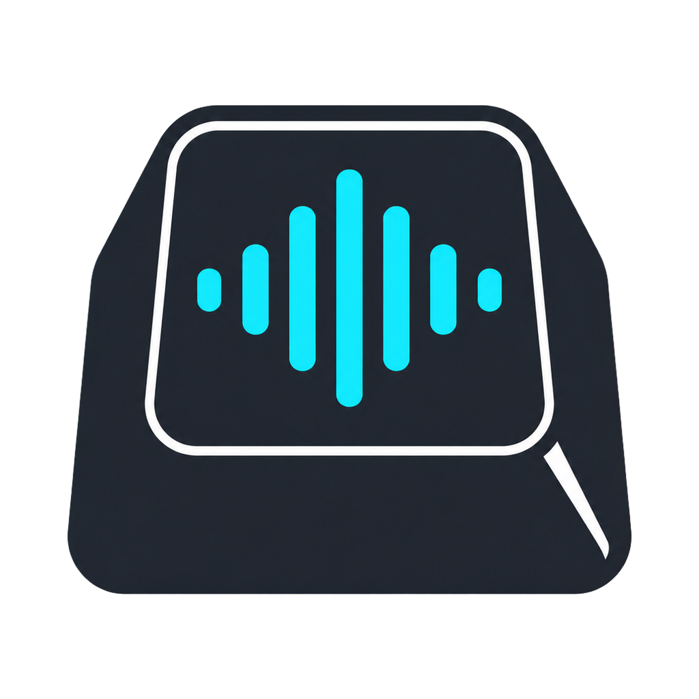

# VoxKey

<p align="center">
  
</p>

**Private, local voice typing for Windows.** Hold your selected hotkey, speak naturally, release, and VoxKey pastes polished English text back into the app you were using.

VoxKey stays out of sight while idle. A small animated orb appears only while
the hotkey is held; it disappears immediately on release while transcription,
polishing, and paste continue locally in the background.

## Local-first by design

- English-only speech recognition using local `small.en` (never `base.en`).
- Local writing polish through a VoxKey-managed Ollama runtime and `qwen3.5:0.8b`.
- No account, subscription, API key, cloud transcription, or raw-text fallback.
- Speech/writer failure means no paste—not an unpolished transcript.

## Requirements

- Windows 10/11 x64
- NVIDIA GPU is optional; VoxKey uses it when the local runtime is available and otherwise uses the same `small.en` model on CPU.
- Internet access and several gigabytes of free disk space are required during first-run setup. Dictation works offline after setup.

## Install and use

1. Download the latest `VoxKey-Setup-*.exe` from Releases.
2. Install for the current Windows user.
3. Start VoxKey and keep it open while it downloads and verifies its private speech and writing runtimes.
4. Wait for `Ready`, click into any ordinary app, hold **Right Ctrl**, **F8**, or **F9**, speak, then release it.

The tray menu opens settings, selects the microphone, toggles sounds, repairs
models, changes the hold hotkey, enables Windows autostart, opens diagnostics,
and quits VoxKey. No separate Ollama installation or command is required.

> Existing beta releases may be unsigned. New tagged releases are blocked unless the application and installer are Authenticode-signed. Always verify the release checksum.

## Limitations

- Windows secure-desktop screens (lock screen, UAC prompts, Ctrl+Alt+Del) cannot accept dictation.
- Windows may block input into an elevated application when VoxKey is not elevated. Run VoxKey as administrator only when you specifically need to dictate into an administrator-run app.
- Vocabulary editing does not yet have a settings interface.

## Diagnostics and privacy

Settings and diagnostics are stored in `%LOCALAPPDATA%\VoxKey`. The latest diagnostic capture is `%LOCALAPPDATA%\VoxKey\last-dictation.wav`; delete it whenever you want. See [privacy details](docs/privacy.md).

## Build from source

```powershell
py -3.12 -m venv .venv
.\.venv\Scripts\python.exe -m pip install -r requirements.txt
.\.venv\Scripts\python.exe -m unittest discover -s tests -v
.\.venv\Scripts\pyinstaller.exe --clean --noconfirm VoxKey.spec
& 'C:\Program Files (x86)\Inno Setup 6\ISCC.exe' installer\VoxKey.iss
```

See [architecture](docs/architecture.md), [Windows smoke testing](docs/windows-v0.1.0-smoke-test.md), [contributing](CONTRIBUTING.md), and [security](SECURITY.md).
